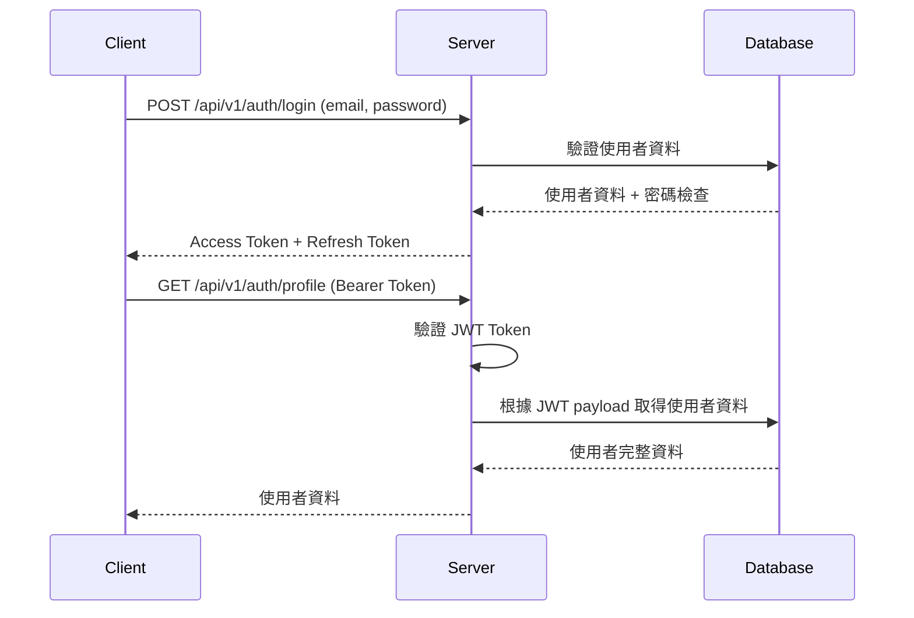

# Neng Shop 電商會員系統

一個基於 Node.js + TypeScript + PostgreSQL 的現代化電商會員系統，支援原生 SQL 和 TypeORM 雙軌開發架構。

## 🎯 專案概述

Neng Shop 是一個完整的電商會員系統，具備使用者管理、商品管理、訂單處理等核心功能。專案採用雙軌技術架構，同時支援原生 SQL 和 TypeORM，適合學習和理解不同資料存取方式的優缺點。

### 核心功能

- **使用者系統**：註冊、登入、權限管理（買家、賣家、管理員） ✅
- **商品系統**：商品 CRUD、庫存管理、搜尋篩選功能 ✅ 
- **分類系統**：6大商品分類、統計分析、完整搜尋支援 ✅
- **認證系統**：JWT 雙權杖、密碼加密、權限控制 ✅
- **權限控制**：基於角色的存取控制（RBAC）✅
- **購物車系統**：購物車 CRUD、庫存檢查、價格快照、智能提醒 ✅
- **訂單系統**：訂單建立、狀態管理、結帳流程、庫存扣減 ✅

## 🛠️ 技術架構

### 後端技術棧

- **框架**: Express.js + TypeScript
- **資料庫**: PostgreSQL (Docker 容器化)
- **ORM**: TypeORM + 原生 SQL (雙軌並行)
- **認證**: JWT + bcrypt
- **驗證**: Joi + class-validator
- **開發工具**: nodemon、ts-node、Docker Compose

### 專案結構

```
src/
├── app.ts           # Express 應用程式主檔案
├── index.ts         # 應用程式入口點
├── config/          # 設定檔案
│   ├── database.ts  # 原生 PostgreSQL 連線配置
│   ├── typeorm.ts   # TypeORM DataSource 配置
│   └── env.ts       # 環境變數管理
├── entities/        # TypeORM 實體定義
│   ├── User.entity.ts
│   ├── Product.entity.ts
│   ├── Cart.entity.ts
│   ├── CartItem.entity.ts
│   ├── Order.entity.ts
│   └── OrderItem.entity.ts
├── models/          # 資料模型定義
├── repositories/    # 資料存取層
│   └── BaseRepository.ts
├── services/        # 業務邏輯層
│   ├── UserService.ts
│   ├── ProductService.ts
│   ├── CartService.ts
│   └── OrderService.ts
├── controllers/     # HTTP 請求處理層
│   ├── AuthController.ts
│   ├── ProductController.ts
│   ├── CartController.ts
│   └── OrderController.ts
├── routes/          # API 路由定義
│   ├── auth.ts      # 認證相關路由
│   ├── products.ts  # 商品相關路由
│   ├── cart.ts      # 購物車相關路由
│   ├── orders.ts    # 訂單相關路由
│   └── index.ts     # 路由入口檔案
├── middleware/      # 中介軟體
├── utils/           # 工具函數
│   ├── password.ts  # 密碼加密工具
│   ├── jwt.ts       # JWT 權杖工具
│   └── apiResponse.ts # API 回應格式化工具
├── types/           # TypeScript 型別定義
│   ├── api.types.ts # API 回應格式
│   ├── user.types.ts # 使用者相關型別
│   ├── product.types.ts # 商品相關型別
│   ├── cart.types.ts # 購物車相關型別
│   └── order.types.ts # 訂單相關型別
└── scripts/         # 開發輔助腳本
    └── testBothConnections.ts
```

## 🚀 快速開始

### 環境要求

- Node.js 18+
- Docker & Docker Compose
- PostgreSQL 15+

### 安裝步驟

1. **克隆專案**
```bash
git clone <repository-url>
cd Neng-shop
```

2. **安裝依賴**
```bash
npm install
```

3. **環境配置**
```bash
# 在 src/config/ 目錄下創建 .env 檔案
DB_HOST=localhost
DB_PORT=5432
DB_NAME=neng_shop
DB_USER=myusername
DB_PASSWORD=mypassword
JWT_SECRET=your-jwt-secret-key
JWT_ACCESS_SECRET=your-access-secret
JWT_REFRESH_SECRET=your-refresh-secret
JWT_ACCESS_EXPIRES_IN=15m
JWT_REFRESH_EXPIRES_IN=7d
PORT=3000
BCRYPT_ROUNDS=12
```

4. **啟動資料庫**
```bash
docker-compose up -d
```

5. **測試連線**
```bash
# 測試原生 SQL 和 TypeORM 連線
npm run dev:db
```

6. **啟動開發服務器**
```bash
npm run dev
```

## 📝 可用指令

```bash
# 開發模式
npm run dev              # 啟動開發服務器
npm run dev:db           # 測試資料庫連線
npm run dev:db:typeorm   # 測試 TypeORM 連線

# 建構
npm run build            # 編譯 TypeScript
npm start               # 啟動生產環境服務器

# 測試 (尚未實作)
# npm test               # 執行測試 (待實作)
```

## 🔧 開發特色

### 雙軌技術架構

本專案採用**雙軌並行**的開發方式：

1. **原生 SQL 層** (`src/config/database.ts`)
   - 使用 `pg` 套件直接連線 PostgreSQL
   - 適合學習 SQL 語句和資料庫操作
   - 提供完整的控制權和效能優化

2. **TypeORM 層** (`src/config/typeorm.ts`)
   - 使用 TypeORM 提供的 Entity 和 Repository
   - 支援裝飾器語法和關聯關係
   - 提供 Migration 和 Schema 同步功能

### 安全性設計

- **密碼安全**: 使用 bcrypt 進行密碼雜湊 (12 rounds)
- **JWT 認證**: 雙權杖系統 (Access + Refresh Token)
- **資料驗證**: Joi 和 class-validator 雙重驗證
- **環境變數**: 敏感資訊全部使用環境變數管理

### 型別安全

- **完整的 TypeScript 支援**: 嚴格模式啟用
- **自定義型別**: 為 API、使用者、資料庫操作定義明確型別
- **裝飾器支援**: 啟用 `experimentalDecorators` 和 `emitDecoratorMetadata`

## 🗃️ 資料庫管理

```bash
# 啟動 PostgreSQL 和 pgAdmin
docker-compose up -d

# 資料庫連線測試
npm run dev:db

# 查看資料庫管理介面
# pgAdmin: http://localhost:8080
# Email: admin@example.com
# Password: admin123
```

## 🔒 認證與授權

### JWT 權杖系統

```typescript
// 生成權杖對
const tokens = JwtUtil.generateTokenPair(user);

// 驗證 Access Token
const payload = JwtUtil.verifyAccessToken(token);

// 驗證 Refresh Token
const refreshPayload = JwtUtil.verifyRefreshToken(refreshToken);
```

### 密碼管理

```typescript
// 密碼加密
const hashedPassword = await PasswordUtils.hash(password);

// 密碼驗證
const isValid = await PasswordUtils.compare(password, hashedPassword);

// 密碼強度檢查
const validation = PasswordUtils.validateStrength(password);
```

## 📡 API 端點文檔

### 認證相關 API ✅ **已實作**

#### 主要端點
- `POST /api/auth/register` - 用戶註冊
- `POST /api/auth/login` - 用戶登入  
- `POST /api/v1/auth/refresh` - 權杖更新
- `GET /api/v1/auth/profile` - 取得個人資料
- `PUT /api/v1/auth/profile` - 更新個人資料
- `PUT /api/v1/auth/password` - 修改密碼
- `POST /api/v1/auth/logout` - 登出

#### 🔄 開發中端點
- `GET /api/v1/auth/google` - Google OAuth 登入

### 商品管理 API ✅ **已實作**

#### 公開API (無需認證)
- `GET /api/v1/products` - 商品列表 (支援搜尋、篩選、分頁、排序)
- `GET /api/v1/products/:id` - 商品詳情
- `GET /api/v1/products/categories` - 分類統計

#### 賣家API (需要認證 + 賣家權限)
- `POST /api/v1/products` - 建立商品
- `PUT /api/v1/products/:id` - 更新商品
- `DELETE /api/v1/products/:id` - 刪除商品 (軟刪除)

#### 支援功能
- **搜尋篩選**: 關鍵字、價格區間、分類篩選
- **排序**: 價格、時間、名稱 (升序/降序)
- **分頁**: 完整分頁機制
- **權限控制**: 賣家只能管理自己的商品
- **商品分類**: 6大分類 (時尚、電子、居家、美妝、運動、其他)

### 購物車管理 API ✅ **已實作**

#### 主要端點 (需要認證)
- `GET /api/v1/cart` - 取得使用者購物車
- `POST /api/v1/cart/items` - 加入商品到購物車
- `PUT /api/v1/cart/items/:cartItemId` - 更新購物車商品數量
- `DELETE /api/v1/cart/items/:cartItemId` - 移除購物車中的商品
- `DELETE /api/v1/cart` - 清空購物車

#### 核心功能
- 庫存驗證與自動調整、價格快照、智能警告系統、自動計算總額

### 訂單管理 API ✅ **已實作**

#### 主要端點 (需要認證)
- `POST /api/v1/orders` - 建立訂單 (從購物車)
- `GET /api/v1/orders` - 取得使用者訂單列表
- `GET /api/v1/orders/:id` - 取得訂單詳情
- `PATCH /api/v1/orders/:id/cancel` - 取消訂單

#### 核心功能
- 購物車轉訂單流程、商品快照保存、Transaction 原子性、悲觀鎖併發控制、庫存回補機制

## 🎨 API 設計

### 統一回應格式
所有 API 回應都遵循標準格式：`{ success, message, data?, error?, timestamp }`

### 錯誤處理
統一的錯誤碼系統，包含認證、權限、資料驗證等錯誤類型

## 📊 開發進度

### 已完成功能

- ✅ **基礎設施建置**
  - Express + TypeScript 專案架構
  - Docker PostgreSQL 環境
  - 雙軌資料庫連線設定
  - 環境變數管理系統

- ✅ **核心工具開發**
  - JWT 權杖管理系統 (Access + Refresh Token)
  - 密碼加密和驗證工具 (bcrypt + 12 rounds)
  - API 回應格式標準化
  - TypeScript 型別定義 (使用者、API、JWT)

- ✅ **資料模型設計**
  - User Entity 完整實作 (軟刪除、角色系統、OAuth 支援)
  - UserService 完整 CRUD 功能
  - 基礎 Repository 抽象類別
  - 資料驗證規則 (Joi + class-validator)

- ✅ **認證系統 (100% 完成)** 🎉
  - 使用者註冊 API (POST /api/v1/auth/register)
  - 使用者登入 API (POST /api/v1/auth/login)
  - **🆕 權杖更新 API (POST /api/v1/auth/refresh)** - 支援 Token 刷新
  - JWT 權杖生成和驗證
  - 密碼強度驗證和加密
  - JWT 中介軟體 (權杖驗證和角色檢查)
  - 受保護 API 端點 (profile, password, logout)

- ✅ **商品管理系統 (100% 完成)** 🎉
  - Product Entity 設計 (商品、分類、狀態、軟刪除)
  - 商品 CRUD API (建立、查詢、更新、刪除)
  - 完整搜尋篩選功能 (關鍵字、價格區間、分類)
  - 分頁和排序機制 (價格、時間、名稱)
  - 6個商品分類系統 (時尚、電子、居家、美妝、運動、其他)
  - 分類統計 API (商品數量、平均價格統計)
  - 賣家權限控制 (只能管理自己的商品)
  - 庫存管理 (自動狀態更新)
  - 商品與用戶關聯 (seller relationship)

- ✅ **購物車系統 (100% 完成)** 🎉
  - Cart 和 CartItem Entity 設計 (一對一和一對多關聯)
  - 購物車 CRUD API (查看、加入、更新、刪除、清空)
  - 庫存自動驗證和數量調整機制
  - 價格快照功能 (記錄加入時的價格)
  - 智能警告系統 (庫存不足、價格變動、低庫存提醒)
  - 自動計算總數量和總金額
  - 完整的商品資訊關聯展示
  - 購物車與用戶一對一關聯 (自動建立)

- ✅ **訂單系統 (100% 完成)** 🎉
  - Order 和 OrderItem Entity 設計 (完整訂單資料模型)
  - 訂單 CRUD API (建立、查詢列表、查詢詳情、取消)
  - 完整結帳流程 (購物車→訂單轉換、商品快照、庫存扣減)
  - Transaction 原子性保證 (4步驟原子操作)
  - 悲觀鎖併發控制 (防止超賣問題)
  - 自定義業務錯誤處理 (BusinessError、EmptyCartError 等)
  - 庫存回補機制 (取消訂單時自動回復庫存)
  - 訂單狀態管理 (pending, cancelled 等狀態)

### 已修復問題

- ✅ **系統穩定性修復**
  - 修正 User Entity 預設值問題 (`isDeleted: false`)
  - 修正 Express 路由順序問題 (API 路由在 404 處理器之前)
  - 完整測試認證系統流程

### 🆕 最新功能 (2025-08-12)

- ✅ **Refresh Token 系統**
  - 實作完整的 Token 刷新機制
  - 支援 Token Rotation 安全策略  
  - 完整的錯誤處理和狀態碼回應
  - 無縫的用戶體驗 (15分鐘 Access Token + 7天 Refresh Token)

### 待開發功能

- 📋 **認證系統進階功能 (可選)**
  - Google OAuth 整合
  - 密碼重設功能
  - Token 黑名單機制

- ✅ **商品管理系統 (第 4 週) - 已完成** 
  - ✅ Product Entity 設計
  - ✅ 商品 CRUD API
  - ✅ 庫存管理機制
  - ✅ 搜尋和篩選功能

- ✅ **購物車系統 (第 5 週) - 已完成**
  - ✅ Cart 和 CartItem Entity 設計
  - ✅ 購物車 CRUD API
  - ✅ 庫存檢查機制
  - ✅ 價格變動處理

- ✅ **訂單處理系統 (第 6 週) - 已完成**
  - ✅ Order 和 OrderItem Entity 設計
  - ✅ 訂單狀態管理 (pending/cancelled)
  - ✅ 完整結帳流程 (購物車→訂單轉換)
  - ✅ Transaction 原子性保證
  - ✅ 悲觀鎖併發控制
  - ✅ 庫存扣減與回補機制

## 🤝 貢獻指南

### 開發規範

1. **程式碼風格**: 遵循 TypeScript 嚴格模式
2. **提交訊息**: 使用 `feat:`, `fix:`, `docs:` 等前綴
3. **分支策略**: 功能分支 → 開發分支 → 主分支
4. **測試要求**: 新功能必須包含相應測試

### 本地開發

```bash
# 確保資料庫運行
docker-compose up -d

# 測試連線
npm run dev:db

# 啟動開發模式
npm run dev

# 編譯檢查
npm run build
```

## 📚 學習資源

### 推薦閱讀

- [TypeORM 官方文檔](https://typeorm.io/)
- [Express.js 最佳實務](https://expressjs.com/en/advanced/best-practice-security.html)
- [JWT 最佳實務](https://tools.ietf.org/html/rfc7519)
- [PostgreSQL 官方文檔](https://www.postgresql.org/docs/)

### 技術對比學習

本專案特別適合學習：
- 原生 SQL vs ORM 的差異
- 不同資料存取模式的優缺點
- 企業級 Node.js 應用架構
- 現代 TypeScript 開發實務

## 📄 授權

本專案採用 MIT 授權條款。

## 🐛 問題回報

如果您發現任何問題，請在 GitHub Issues 中回報。

---

**專案狀態**: 穩定開發中 | **版本**: 0.6.0 | **最後更新**: 2025-10-09

**目前進度**: 第 6 週 - 訂單系統 (100% 完成) 🎉 | **下一里程碑**: 賣家後台管理系統

## 🎉 里程碑達成 - 完整電商購物系統

恭喜！你已經成功實作了一個完整的電商購物系統，包含認證系統、商品管理系統、購物車系統和訂單系統：

### 🔐 企業級認證系統 (第3週)
- ✅ 用戶註冊與登入
- ✅ JWT Access Token (15分鐘) + Refresh Token (7天) 
- ✅ Token 自動刷新機制
- ✅ 角色權限控制 (buyer/seller/admin)
- ✅ 受保護 API 端點
- ✅ bcrypt 密碼加密 (12 rounds)
- ✅ JWT 簽名驗證與Token Rotation 防護

### 🛍️ 完整商品管理系統 (第4週)
- ✅ 商品CRUD操作 (建立、查詢、更新、軟刪除)
- ✅ 6大商品分類系統 (時尚、電子、居家、美妝、運動、其他)
- ✅ 關鍵字搜尋功能 (商品名稱、描述、分類、賣家)
- ✅ 進階篩選功能 (價格區間、分類篩選)
- ✅ 排序機制 (價格、時間、名稱，升序/降序)
- ✅ 完整分頁功能 (頁數、總數、前後頁判斷)
- ✅ 分類統計API (商品數量、平均價格)
- ✅ 賣家權限控制 (只能管理自己的商品)
- ✅ 庫存管理 (自動狀態更新)

### 🛒 完整購物車系統 (第5週)
- ✅ 購物車實體設計 (Cart + CartItem 關聯設計)
- ✅ 購物車CRUD操作 (查看、加入、更新、移除、清空)
- ✅ 智能庫存檢查 (自動驗證庫存並調整數量)
- ✅ 價格快照機制 (記錄加入時的商品價格)
- ✅ 智能警告系統 (庫存不足、價格變動、低庫存提醒)
- ✅ 自動計算功能 (總數量、總金額即時計算)
- ✅ 商品資訊展示 (完整商品詳情、圖片、狀態)
- ✅ 用戶關聯管理 (一對一購物車自動建立)

### 📦 企業級訂單系統 (第6週)
- ✅ 訂單實體設計 (Order + OrderItem 完整關聯設計)
- ✅ 訂單CRUD操作 (建立、查詢列表、查詢詳情、取消)
- ✅ 企業級結帳流程 (購物車→訂單轉換、商品快照)
- ✅ Transaction 原子性保證 (4步驟原子操作確保資料一致性)
- ✅ 悲觀鎖併發控制 (防止超賣問題)
- ✅ 智能庫存管理 (扣減與回補機制)
- ✅ 自定義業務錯誤 (BusinessError、EmptyCartError、InsufficientStockError)
- ✅ 訂單狀態管理 (pending, cancelled 等狀態轉換)

### 📊 系統品質
- ✅ 統一 API 回應格式
- ✅ TypeScript 型別安全
- ✅ 完整的錯誤處理
- ✅ 清晰的程式碼結構
- ✅ RESTful API 設計

## 🔧 JWT 運作原理

### JWT 認證流程



### JWT Token 結構

```javascript
// Access Token Payload
{
  id: 2,
  email: "test@example.com", 
  role: "buyer",
  iat: 1754909708,  // 發行時間
  exp: 1754910608,  // 過期時間 (15分鐘)
  aud: "neng-shop-users",  // 受眾
  iss: "neng-shop"  // 發行者
}

// JWT 中介軟體處理流程
1. 檢查 Authorization header 是否存在
2. 提取 Bearer token 
3. 驗證 token 有效性 (簽名、過期時間)
4. 將解碼後的使用者資料注入到 req.user
5. 繼續處理請求
```

### 安全特性

- **無狀態**: 伺服器不需要儲存 session
- **自包含**: token 包含所有必要的使用者資訊
- **過期機制**: Access Token 15分鐘自動過期
- **角色檢查**: 支援 buyer/seller/admin 權限控制

